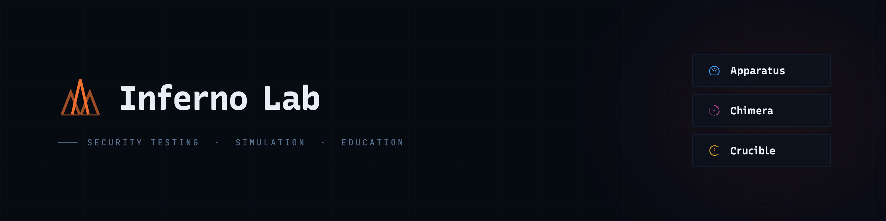

<div align="center">




Unified control plane for the Inferno Lab security testing stack.
Orchestrates [Apparatus](https://github.com/nickcrew/apparatus), [Chimera](https://github.com/nickcrew/chimera), and [Crucible](https://github.com/nickcrew/crucible) from a single web dashboard with process management, health monitoring, and live log streaming.

</div>

---

## What is Inferno Lab?

Inferno Lab is a **web-based orchestration dashboard** that manages the three Inferno Lab services as native child processes. It provides:

- **Process Management** — Start, stop, and restart services with dependency-ordered startup
- **Health Monitoring** — Live polling of health endpoints with latency tracking and failure detection
- **Log Aggregation** — Real-time log streaming from all services with per-service filtering and search
- **Profiles** — Named presets (`full-lab`, `apparatus-only`, `chimera-stack`, `testing`) that start service subsets in the correct order
- **Unified Configuration** — Single `config.yaml` that wires service ports, environment variables, and inter-service connections

## Architecture

```
inferno-lab/
├── packages/shared     # @inferno-lab/shared — types, Zod config schema
├── packages/server     # @atlascrew/inferno-lab — Express + WebSocket backend (publishable)
└── packages/web        # @inferno-lab/web — Vite + React dashboard
```

| Component | Stack | Role |
|-----------|-------|------|
| **Server** | Express 5, WebSocket (ws), js-yaml, Zod | Process supervisor, health poller, log buffer, REST + WS API |
| **Web** | React 19, Tailwind CSS 4, Zustand 5, Radix UI | Dashboard UI with real-time state via WebSocket |
| **Shared** | TypeScript, Zod | Service types, config schema, WS protocol definitions |

### Managed Services

| Service | Default Ports | Health Endpoint |
|---------|---------------|-----------------|
| **Apparatus** — Multi-protocol security lab | 8090, 8443, 50051 | `/healthz` |
| **Chimera API** — Vulnerable application (Flask) | 8880 | `/health` |
| **Chimera Web** — Vulnerable frontend (React) | 5175 | `/` |
| **Crucible** — Attack simulation engine | 3000, 3001 | `/health` |

### Dependency Graph

```
Apparatus ──► Chimera API ──► Chimera Web
                  │
                  └──► Crucible
```

## Installation

### npm (recommended)

```bash
npm install -g @atlascrew/inferno-lab
inferno-lab start
```

Then create a `config.yaml` in your working directory (or set `CONFIG_PATH`) with your service definitions. See [Configuration](#configuration) below.

### Docker

```bash
docker run -p 4200:4200 \
  -v $(pwd)/config.yaml:/app/config.yaml \
  nickcrew/inferno-lab:latest
```

The image ships with a default `config.yaml` baked in, but mounting your own lets you point the services at the correct host paths.

### From source

```bash
# Install dependencies
pnpm install

# Development (server :4200 + Vite HMR :4201)
just dev

# Production build
just build && just start
```

Open `http://localhost:4200` (production) or `http://localhost:4201` (dev with proxy).

## Configuration

All services are defined in `config.yaml` at the project root:

```yaml
lab:
  name: "Inferno Lab"
  shutdownGracePeriodMs: 10000

services:
  apparatus:
    name: "Apparatus"
    cwd: "/path/to/Apparatus"
    command: "pnpm"
    args: ["dev:server"]
    healthCheck:
      url: "http://127.0.0.1:8090/healthz"
      intervalMs: 5000
      timeoutMs: 3000
    ports:
      http1: 8090
    env:
      DEMO_MODE: "true"
    readyPattern: "listening on"
    dependencies: []

profiles:
  full-lab:
    description: "All services"
    services: ["apparatus", "chimera-api", "chimera-web", "crucible"]
```

Key config concepts:

- **`readyPattern`** — Regex matched against stdout to detect when a service is ready (faster than waiting for health endpoints)
- **`dependencies`** — DAG of service startup order; the orchestrator topologically sorts this before launching
- **`profiles`** — Named service subsets for different use cases

## API

### REST

| Method | Path | Description |
|--------|------|-------------|
| `GET` | `/api/services` | List all services with status |
| `POST` | `/api/services/:id/start` | Start a service |
| `POST` | `/api/services/:id/stop` | Stop a service |
| `POST` | `/api/services/:id/restart` | Restart a service |
| `GET` | `/api/profiles` | List available profiles |
| `POST` | `/api/profiles/:name/start` | Start a profile |
| `POST` | `/api/stop-all` | Stop all running services |
| `GET` | `/health` | Dashboard health check |

### WebSocket

Connect to `ws://localhost:4200/ws`. The server sends a full `LAB_STATE` snapshot on connection, then streams `SERVICE_UPDATE`, `HEALTH_UPDATE`, and `LOG_OUTPUT` deltas.

Client commands: `START_SERVICE`, `STOP_SERVICE`, `RESTART_SERVICE`, `START_PROFILE`, `STOP_ALL`, `SUBSCRIBE_LOGS`, `UNSUBSCRIBE_LOGS`.

## Design System

Inferno Lab uses the brand system built on [Recursive](https://www.recursive.design) — a single variable font that covers both sans-serif and monospace through axis interpolation. See [`brand/typography/TYPOGRAPHY.md`](brand/typography/TYPOGRAPHY.md) for the full type system specification.
